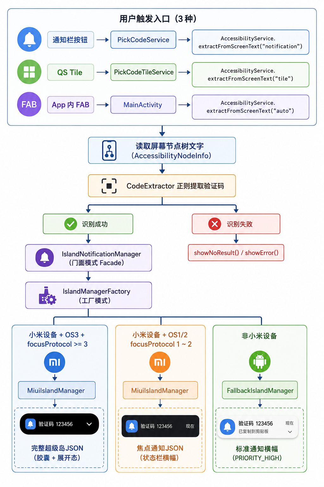

# 码速达 (PickCode)

> 一键识别快递取件码 / 取餐码，通过通知栏展示，随取随用。

[](https://github.com/zhaodda/pickcode/actions)

---

## 功能特性

| 功能 | 说明 |
|------|------|
| 屏幕文字提取 | 通过无障碍服务（AccessibilityService）读取屏幕节点树文字，无需截图、无需 OCR 授权弹窗 |
| 通知栏展示 | 识别结果通过标准 Android 高优先级通知横幅展示，支持多条通知同时存在 |
| 一键复制 | 每条通知带"复制"按钮，点击即复制到剪贴板并关闭该条通知 |
| 通知栏入口 | 前台常驻通知，点击即触发屏幕识别 |
| Quick Settings Tile | 下拉快捷开关一键触发 |
| 手动输入 | 支持粘贴短信自动解析 + 手动填写验证码 |
| 智能分类 | 自动区分快递码 / 取餐码 / 停车码，对应颜色高亮 |
| 历史记录 | Room 本地存储，支持收藏、复制、删除 |
| 运行日志 | 完整的运行日志系统，方便排查问题 |

## 支持的验证码类型

- **快递取件码** - 菜鸟驿站、蜂鸟、京东快递、顺丰等 4~8 位取件码
- **餐饮取餐码** - 喜茶、奈雪等奶茶 / 外卖自提 3~6 位取餐号
- **停车取车码** - 1~4 位停车场短码
- **通用数字验证码** - 4~8 位数字兜底匹配

## 技术架构

### 整体架构：MVVM



### 核心技术方案

#### 文字提取 — 无障碍节点树遍历

不截图、不走 OCR，直接读取 Android 系统提供的 UI 节点树：

1. `PickCodeAccessibilityService.getRootInActiveWindow()` 获取当前窗口根节点
2. `getAllTextFromNode()` 递归遍历所有子节点，拼接 `getText()` + `getContentDescription()`
3. `CodeExtractor.extractFromText()` 在纯文本中正则匹配取件码

**优势**：零权限弹窗、零网络请求、完全离线、即时响应。

#### 通知栏展示 — 标准 NotificationCompat

每次识别到取件码发送一条独立的高优先级横幅通知（`PRIORITY_HIGH`）：

```
识别成功 → CodeRecord(类型, 验证码)
                │
        IslandNotificationManager.showCode()
                │
        NotificationCompat.Builder (CHANNEL_CODE, IMPORTANCE_HIGH)
                │
        ├── setContentTitle("📦 快递取件")
        ├── setContentText("取件码：06675")
        ├── setColor / setColorized（按类型着色）
        └── addAction("📋 复制", copyPendingIntent)
                        │
              notificationManager.notify(递增ID, notification)

用户点击"复制" → CopyCodeReceiver → 剪贴板 → cancel(本条通知ID)
```

## 项目结构

```
app/src/main/java/com/pickcode/app/
├── PickCodeApp.kt                          # Application 入口
│
├── data/
│   ├── model/CodeRecord.kt                 # 数据模型（Room Entity）
│   ├── db/                                 # Room DAO + Database
│   │   ├── CodeRecordDao.kt
│   │   └── PickCodeDatabase.kt
│   └── repository/CodeRepository.kt
│
├── ocr/
│   └── CodeExtractor.kt                    # 正则提取核心（纯文本入口）
│
├── overlay/
│   └── IslandNotificationManager.kt         # 取件码通知管理器（标准通知）
│
├── service/
│   ├── PickCodeAccessibilityService.kt     # ★ 核心：无障碍节点树文字提取
│   ├── PickCodeService.kt                  # 前台常驻服务（触发中转）
│   ├── CopyCodeReceiver.kt                 # "复制"按钮广播接收器
│   └── BootReceiver.kt                     # 开机自启
│
├── tile/
│   └── PickCodeTileService.kt              # Quick Settings Tile
│
├── ui/
│   ├── activity/
│   │   ├── MainActivity.kt                 # 主界面（FAB + 手动输入）
│   │   ├── LogViewerActivity.kt            # 运行日志查看器
│   │   ├── SettingsActivity.kt             # 设置页
│   │   └── PermissionActivity.kt           # 权限引导页
│   ├── fragment/SettingsFragment.kt
│   ├── adapter/CodeRecordAdapter.kt
│   └── viewmodel/MainViewModel.kt
│
└── util/
    └── AppLog.kt                          # 运行日志管理器
```

## 技术栈

| 类别 | 技术 | 版本 |
|------|------|------|
| 语言 | Kotlin | — |
| 架构 | MVVM + Coroutines + StateFlow | — |
| UI | Material Design 3 | 1.11.0 |
| 数据库 | Room | 2.6.1 |
| 生命周期 | Lifecycle ViewModel / LiveData | 2.7.0 |
| 协程 | kotlinx-coroutines-android | 1.7.3 |
| 设置页 | PreferenceX | 1.2.1 |

**编译环境**：compileSdk 34 / minSdk 26 / targetSdk 33

## 所需权限

| 权限 | 用途 | 必须 |
|------|------|------|
| `BIND_ACCESSIBILITY_SERVICE` | 无障碍服务（屏幕文字提取） | ✅ 必须 |
| `POST_NOTIFICATIONS` | 通知栏展示（Android 13+） | ✅ 必须 |
| `FOREGROUND_SERVICE` (specialUse) | 前台常驻服务保活 | ✅ 必须 |
| `RECEIVE_BOOT_COMPLETED` | 开机自启服务 | ⚪ 可选 |

> 已移除 `SYSTEM_ALERT_WINDOW`（悬浮窗）、`FOREGROUND_SERVICE_MEDIA_PROJECTION`（录屏）。

## 首次使用指南

1. 安装后打开「码速达」，授予**通知权限**
2. 进入 **设置 → 无障碍**，找到「码速达」并开启无障碍服务
3. 添加 **Quick Settings Tile**（快捷开关）：下拉通知面板 → 编辑 ✏️ → 找到「码速达」拖入
4. 使用任意方式触发识别：
   - 点击通知栏上的 **「立即识别」** 按钮
   - 下拉 QS 面板点击 **「码速达」** 磁贴
   - 在 App 内点击 **识别** 按钮
5. 识别到的验证码以通知横幅形式弹出，点击 **复制** 即可复制到剪贴板

## 构建

### 环境要求

- JDK 17+
- Android SDK（build-tools 34.0.0、platforms android-34）
- Gradle 8.2（由 wrapper 管理）

```bash
# Debug 包
./gradlew assembleDebug
# 输出：app/build/outputs/apk/debug/PickCode-v1.x.x-debug.apk
```

GitHub Actions 自动打包：push 到 `main` 分支即可触发，APK 在 Actions → Artifacts 中下载。

## 版本历史

| 版本 | 要点 |
|------|------|
| v2.0.0 | 重构：移除超级岛模块，改为标准 Android 通知栏展示；支持多条通知同时存在 |
| v1.5.1 | 修复超级岛 JSON 格式（添加 protocol:1、规范图片 key、对齐官方文档）|
| v1.5.0 | 重构超级岛模块，剔除 OPPO/vivo 灵动岛代码（净减少 670 行）|
| v1.4.2 | 超级岛参数调优（timeout/islandTimeout/enableFloat/reopen）|
| v1.4.1 | 增加超级岛诊断日志链路 |
| v1.4.0 | 修复 QS 磁贴误按 BACK 导致 App 返回上一页 |
| v1.3.3 | 新增面板残留自动重试机制（looksLikePanelText）|
| v1.3.2 | Tile 磁贴 startActivityAndCollapse 修复 |
| v1.3.1 | GLOBAL_ACTION_BACK 替代无效的 collapsePanels 反射 |
| v1.3.0 | 彻底弃用截屏方案，改为纯无障碍节点树文字提取 |
| v1.1.0 | 新增运行日志系统；改用 AccessibilityService 截屏 |
| v1.0.3 | 新增手动输入功能 |
| v1.0.2 | 闪退修复（targetSdk 34→33 + FGS type=specialUse）|

## License

MIT
