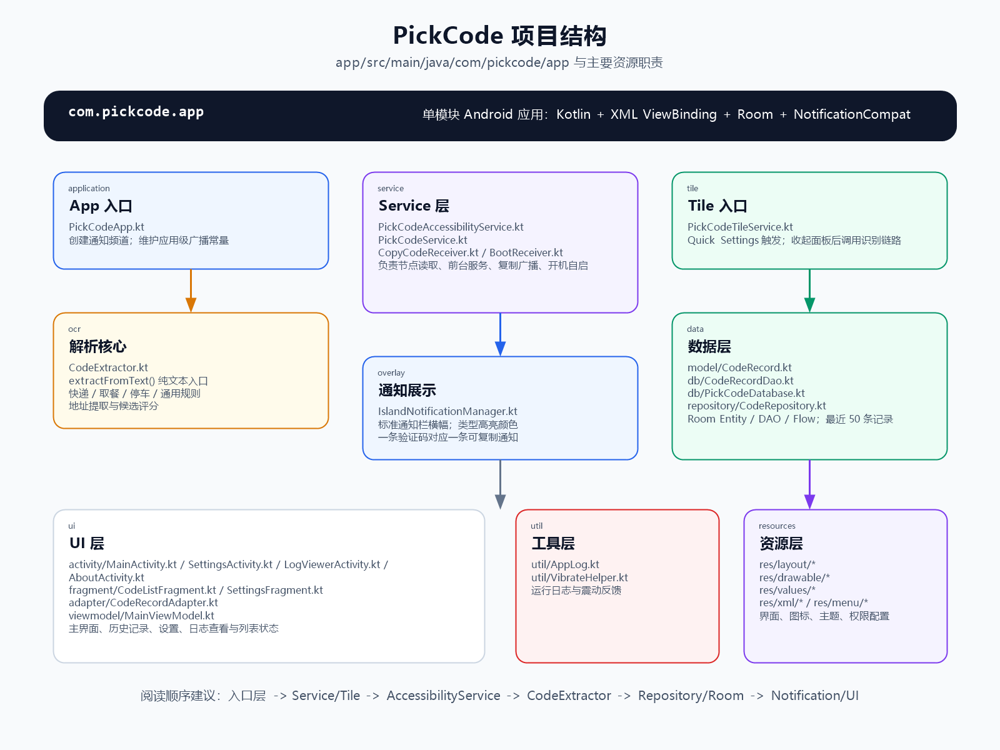

# 码住 PickCode

> 一键识别快递取件码、取餐码、停车码，并通过 Android 通知栏快速复制。

[](https://github.com/zhaodda/pickcode/actions)

## 项目简介

码住是一个本地优先的 Android 取件码识别工具。用户主动点击通知栏按钮、Quick Settings Tile 或在 App 内手动输入后，应用会读取当前屏幕可见文字并在本机解析验证码，识别结果以高优先级通知展示，点击通知按钮即可复制。

当前主链路不截图、不录屏、不上传网络，识别和历史记录都在设备本地完成。

## 核心能力

| 能力 | 说明 |
| --- | --- |
| 屏幕文字提取 | 通过 `AccessibilityService` 读取屏幕节点树文字，主链路无需截图或录屏授权 |
| 本地规则解析 | `CodeExtractor` 基于纯文本正则匹配，支持取件码、取餐码、停车码和通用验证码 |
| 通知栏展示 | 每次识别结果生成一条独立的高优先级通知，支持多条通知并存 |
| 一键复制 | 通知 Action 调用 `CopyCodeReceiver`，复制后精确关闭当前通知 |
| 快捷入口 | 支持常驻通知按钮、Quick Settings Tile、App 内手动输入 |
| 历史记录 | Room 本地存储最近 50 条记录，支持收藏、删除和标记已取件 |
| 运行日志 | 内置日志查看器，方便定位识别、通知和权限问题 |

## 支持类型

| 类型 | 示例场景 | 规则概览 |
| --- | --- | --- |
| 快递取件码 | 菜鸟驿站、丰巢、顺丰、京东快递等 | 数字、字母、连字符混合取件码，并可提取驿站地址 |
| 餐饮取餐码 | 奶茶、外卖、自提订单 | 3 到 6 位数字或少量字母前缀 |
| 停车取车码 | 停车场、车牌相关短码 | 字母加短数字组合 |
| 通用验证码 | 其他短信或页面验证码 | 4 到 8 位数字兜底匹配 |

## 识别架构


主流程：

1. 用户通过通知栏、QS Tile 或手动输入主动触发。
2. `PickCodeAccessibilityService` 调用 `getRootInActiveWindow()` 读取当前屏幕节点树。
3. 递归拼接节点的 `text` 与 `contentDescription`。
4. `CodeExtractor.extractFromText()` 在纯文本中匹配验证码并分类。
5. 成功时写入 Room，并通过 `IslandNotificationManager` 发送可复制通知。
6. 失败或异常时发送轻量提示通知，便于用户重试。

## 项目结构



主要目录：

| 目录 | 职责 |
| --- | --- |
| `app/src/main/java/com/pickcode/app/service` | 无障碍服务、前台服务、复制广播、开机自启 |
| `app/src/main/java/com/pickcode/app/ocr` | 文本解析与验证码提取规则 |
| `app/src/main/java/com/pickcode/app/overlay` | 通知栏展示与通知 Action 管理 |
| `app/src/main/java/com/pickcode/app/data` | Room 实体、DAO、数据库与仓库 |
| `app/src/main/java/com/pickcode/app/ui` | 主界面、设置、日志、历史列表和 ViewModel |
| `app/src/main/res` | XML 布局、主题、图标、菜单和权限配置 |

## 技术栈

| 类别 | 技术 / 版本 |
| --- | --- |
| 语言 | Kotlin 1.9.22 |
| 构建 | Android Gradle Plugin 8.2.2、Gradle Wrapper 8.2 |
| 架构 | MVVM、Coroutines、Flow / LiveData |
| UI | Android XML ViewBinding、Material Components 1.11.0 |
| 数据库 | Room 2.6.1 |
| 生命周期 | AndroidX Lifecycle 2.7.0 |
| 快捷入口 | Android Quick Settings Tile |
| 通知 | NotificationCompat、高优先级通知 Channel |

编译配置：`compileSdk 34`、`minSdk 26`、`targetSdk 34`、JVM 17。

## 权限说明

| 权限 | 用途 | 是否必须 |
| --- | --- | --- |
| `BIND_ACCESSIBILITY_SERVICE` | 绑定无障碍服务，用于用户主动触发时读取屏幕可见文字 | 必须 |
| `POST_NOTIFICATIONS` | Android 13+ 展示通知栏识别结果 | 必须 |
| `FOREGROUND_SERVICE` | 前台常驻服务 | 必须 |
| `FOREGROUND_SERVICE_SPECIAL_USE` | Android 14+ 前台服务 specialUse 类型声明 | 必须 |
| `RECEIVE_BOOT_COMPLETED` | 设备重启后自动启动服务 | 可选 |
| `VIBRATE` | 识别成功时震动反馈 | 可选 |

已移除悬浮窗和录屏相关权限：`SYSTEM_ALERT_WINDOW`、`FOREGROUND_SERVICE_MEDIA_PROJECTION`。

## 首次使用

1. 安装并打开「码住」，授予通知权限。
2. 进入系统设置里的无障碍服务，找到「码住」并开启。
3. 可选：下拉通知面板，编辑 Quick Settings，把「码住识别」磁贴拖入快捷区。
4. 打开包含取件码的短信、快递页面或通知内容。
5. 点击常驻通知里的「立即识别」，或点击 QS Tile。
6. 识别成功后，在弹出的通知中点击「复制」。

## 构建

环境要求：

| 工具 | 要求 |
| --- | --- |
| JDK | 17+ |
| Android SDK | platform android-34、build-tools 34.x |
| Gradle | 使用仓库内 `gradlew` |

```bash
# Debug 包
./gradlew assembleDebug

# 输出示例
app/build/outputs/apk/debug/PickCode-v2.0.0-debug.apk
```

GitHub Actions 会在 push 或 pull request 到 `main` / `master` 时自动构建 Debug APK，并上传到 Actions Artifacts。

## 版本历史

| 版本 | 要点 |
| --- | --- |
| v2.0.0 | 移除超级岛模块，改为标准 Android 通知栏展示；支持多条通知同时存在 |
| v1.5.1 | 修复超级岛 JSON 格式，补齐 `protocol:1` 与图片 key |
| v1.5.0 | 重构超级岛模块，剔除 OPPO / vivo 灵动岛代码 |
| v1.4.x | 优化超级岛参数、诊断日志和 QS Tile 行为 |
| v1.3.0 | 弃用截屏方案，改为无障碍节点树文字提取 |
| v1.1.0 | 新增运行日志系统 |
| v1.0.3 | 新增手动输入功能 |

## License

MIT
